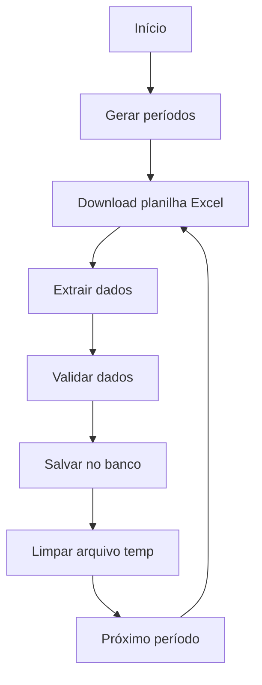

# 📊 CNC - Sistema de Coleta de Indicadores Econômicos

Sistema automatizado para extração, processamento e armazenamento dos principais indicadores econômicos da Confederação Nacional do Comércio (CNC). O projeto coleta dados dos indicadores ICEC, ICF e PEIC de forma automatizada através de múltiplas fontes.

---

## 🚀 Visão Geral

O **CNC** é um sistema robusto desenvolvido em TypeScript que automatiza a coleta de dados econômicos essenciais:

- **ICEC** (Índice de Confiança do Empresário do Comércio)
- **ICF** (Índice de Confiança do Consumidor)  
- **PEIC** (Pesquisa de Endividamento e Inadimplência do Consumidor)

### Características Principais

✅ **Coleta Híbrida**: Combina download direto de planilhas e web scraping  
✅ **Arquitetura Modular**: Separação clara de responsabilidades por serviços  
✅ **Processamento Automático**: Agendamento inteligente via cron jobs  
✅ **Fallback Robusto**: Sistema de retry com web scraping em caso de falha  
✅ **Dados Históricos**: Coleta desde 2010 até o período atual  
✅ **Multi-região**: Suporte para Brasil (BR) e Espírito Santo (ES)  

---

## 🛠️ Tecnologias Utilizadas

### Core
- **Node.js** - Runtime JavaScript
- **TypeScript** - Linguagem com tipagem estática
- **TypeORM** - ORM para banco de dados
- **MySQL** - Sistema de gerenciamento de banco de dados

### Automação e Processamento
- **Playwright** - Automação de navegador para web scraping
- **XLSX** - Processamento de planilhas Excel
- **Axios** - Cliente HTTP para downloads
- **Node-Cron** - Agendamento de tarefas

### Utilitários
- **fs-extra** - Manipulação de arquivos
- **dotenv** - Gerenciamento de variáveis de ambiente
- **reflect-metadata** - Suporte a decorators do TypeORM

---

## 📁 Estrutura do Projeto

```
CNC/
├── src/
│   ├── index.ts                 # Ponto de entrada da aplicação
│   ├── force.ts                 # Execução forçada dos processos
│   └── server/
│       ├── database/            # Configuração do banco de dados
│       │   ├── data-source.ts   # Configuração TypeORM
│       │   ├── entities/        # Entidades do banco
│       │   │   ├── Icec.ts      # Entidade ICEC
│       │   │   ├── Icf.ts       # Entidade ICF
│       │   │   └── Peic.ts      # Entidade PEIC
│       │   ├── migrations/      # Migrações do banco
│       │   └── repositories/    # Repositórios de dados
│       ├── scheduler/           # Orquestração de tarefas
│       │   └── orchestrator.ts  # Gerenciador de cron jobs
│       ├── services/            # Lógica de negócio
│       │   ├── icec.ts          # Serviço ICEC
│       │   ├── icf.ts           # Serviço ICF
│       │   └── peic.ts          # Serviço PEIC
│       ├── shared/              # Interfaces e tipos compartilhados
│       │   └── interfaces.ts    # Definições de tipos
│       └── tests/               # Testes e scripts de debug
├── temp/                        # Arquivos temporários
├── build/                       # Código compilado
└── package.json                 # Dependências e scripts
```

---

## ⚙️ Configuração e Instalação

### Pré-requisitos
- Node.js (versão 18 ou superior)
- MySQL (versão 8 ou superior)
- NPM ou Yarn

### 1. Clone o repositório
```bash
git clone <url-do-repositorio>
cd CNC
```

### 2. Instale as dependências
```bash
npm install
```

### 3. Configure as variáveis de ambiente
Crie um arquivo `.env` na raiz do projeto baseado no `.env.example`:

```env
# Definição do Ambiente
NODE_ENV=development

# Configurações do Banco de Dados
HOST=localhost
DB_USER=seu_usuario
DB_NAME=cnc_database
DB_PORT=3306
PASSWORD=sua_senha

# Configurações do Web Scraping (credenciais do portal CNC)
CREDENTIALS_USER=seu_usuario_cnc
CREDENTIALS_PASSWORD=sua_senha_cnc

# URL Base da API para Downloads
BASE_URL=https://backend.pesquisascnc.com.br/admin/4/upload

# URLs dos Sites (opcionais - usam valores padrão se não informadas)
BASE_URL_SITE_PEIC=https://pesquisascnc.com.br/pesquisa-peic/
BASE_URL_SITE_ICEC=https://pesquisascnc.com.br/pesquisa-icec/
BASE_URL_SITE_ICF=https://pesquisascnc.com.br/pesquisa-icf/
```

⚠️ **Importante**: As credenciais `CREDENTIALS_USER` e `CREDENTIALS_PASSWORD` são necessárias para o sistema de fallback via web scraping. Utilize as credenciais de acesso ao portal da CNC.

### 4. Execute as migrações do banco
```bash
npm run migration:run
```

### 5. Inicie a aplicação
```bash
# Modo desenvolvimento
npm run dev

# Modo produção
npm start

# Execução forçada (sem aguardar cron)
npm run force
```

---

## 📅 Funcionamento dos Serviços

### ICEC - Índice de Confiança do Empresário do Comércio
- **Período**: Janeiro/2010 → presente
- **Agendamento**: Todo dia 1 às 02:00
- **Dados coletados**: Índices por porte de empresa e segmento comercial

### ICF - Índice de Confiança do Consumidor
- **Período**: Janeiro/2010 → presente  
- **Agendamento**: Todo dia 1 às 05:00
- **Dados coletados**: Índices de satisfação e expectativa do consumidor

### PEIC - Pesquisa de Endividamento e Inadimplência
- **Período**: Janeiro/2010 → mês anterior
- **Agendamento**: Todo dia 1 às 08:00
- **Dados coletados**: Percentuais de endividamento por faixa de renda

---

## 🔄 Fluxo de Processamento

### 1. Método Principal - Download de Planilhas


### 2. Método de Fallback - Web Scraping
Em caso de falha no download, o sistema utiliza web scraping:
- Abertura automatizada do navegador
- Login no portal CNC
- Navegação e filtros por período/região
- Extração dos dados da tabela gerada
- Processamento e armazenamento

### 3. Características do Processamento
- **Prevenção de duplicatas**: Verificação antes de inserir dados
- **Limpeza automática**: Remoção de dados antigos antes de reprocessar
- **Logs detalhados**: Acompanhamento completo do processo
- **Retry inteligente**: Segunda tentativa com método alternativo

---

## 🗄️ Estrutura do Banco de Dados

### Tabela: icecs
```sql
- id (UUID, PK)
- ICEC (FLOAT) - Índice geral
- ATÉ_50 (FLOAT) - Empresas até 50 funcionários  
- MAIS_DE_50 (FLOAT) - Empresas com mais de 50 funcionários
- SEMIDURAVEIS (FLOAT) - Segmento semiduráveis
- NAO_DURAVEIS (FLOAT) - Segmento não duráveis
- DURAVEIS (FLOAT) - Segmento duráveis
- MES (INT) - Mês de referência
- ANO (INT) - Ano de referência
- REGIAO (ENUM) - BR ou ES
- METODO (ENUM) - Planilha ou Web Scraping
- data_criacao (TIMESTAMP)
- data_atualizacao (TIMESTAMP)
```

### Tabela: icfs
```sql
- id (UUID, PK)
- ICF (FLOAT) - Índice geral
- SITUACAO_ATUAL (FLOAT) - Avaliação situação atual
- EXPECTATIVAS (FLOAT) - Expectativas futuras
- MES (INT) - Mês de referência
- ANO (INT) - Ano de referência
- REGIAO (ENUM) - BR ou ES
- METODO (ENUM) - Planilha ou Web Scraping
- data_criacao (TIMESTAMP)
- data_atualizacao (TIMESTAMP)
```

### Tabela: peics
```sql
- id (UUID, PK)
- ENDIVIDADOS (FLOAT) - % de famílias endividadas
- ATE_1000 (FLOAT) - Renda até R$ 1.000
- _1000_3000 (FLOAT) - Renda R$ 1.000-3.000
- _3000_5000 (FLOAT) - Renda R$ 3.000-5.000
- _5000_10000 (FLOAT) - Renda R$ 5.000-10.000
- MAIS_10000 (FLOAT) - Renda acima R$ 10.000
- MES (INT) - Mês de referência
- ANO (INT) - Ano de referência
- REGIAO (ENUM) - BR ou ES
- METODO (ENUM) - Planilha ou Web Scraping
- data_criacao (TIMESTAMP)
- data_atualizacao (TIMESTAMP)
```

---

## 🔧 Scripts Disponíveis

```bash
# Desenvolvimento
npm run start          # Inicia aplicação (modo produção)
npm run dev            # Inicia com hot-reload
npm run force          # Executa processamento imediato

# Banco de Dados
npm run typeorm        # CLI do TypeORM
npm run migration:generate  # Gera nova migração
npm run migration:run       # Executa migrações
npm run migration:revert    # Reverte última migração

# Build
npm run build          # Compila TypeScript para JavaScript
```

---

## 📊 Monitoramento e Logs

### Logs Estruturados
O sistema produz logs detalhados para acompanhamento:

```
🚀 Iniciando processamento completo dos dados ICEC...
🗑️ Limpeza do banco de dados concluída. Registros removidos: 1,245
📍 Regiões a processar: BR, ES

Processando período: BR 01/2024
✅ Período BR 01/2024 processado com sucesso

=== Processamento concluído ===
Sucessos: 156
Erros: 2  
Total: 158
```

### Indicadores de Performance
- Tempo médio de processamento por período
- Taxa de sucesso vs fallback para web scraping
- Quantidade de registros processados por execução

---

## 🆚 Comparação: Projeto ICEC Antigo vs CNC Atual

### Projeto ICEC (Versão Anterior)

#### ❌ **Problemas Críticos Identificados**

**Segurança:**
- Credenciais hardcoded no código fonte
- Variáveis de ambiente expostas no repositório
- Sem criptografia de dados sensíveis

**Arquitetura:**
- Sistema monolítico em arquivo único (`index.ts`)
- Ausência de separação de responsabilidades
- Dependências não gerenciadas adequadamente

**Tratamento de Erros:**
- Try-catch genérico sem especificidade
- Retry limitado e inadequado
- Logs insuficientes para debugging
- Falhas silenciosas mascaradas como sucesso

**Performance:**
- Processamento sequencial ineficiente
- Falta de paralelização de tarefas
- Ausência de validação de dados

**Manutenção:**
- Código não modular
- Difícil escalabilidade
- Debugging complexo

#### 🔧 **Características Técnicas**
```typescript
// Exemplo de código problemático do projeto antigo
await page.getByLabel('Username or Email').fill('usuario@hardcoded.com');
await page.getByLabel('Senha').fill('senhaHardcoded123');

// Processamento sequencial
for (let year = initialYear; year <= currentYear; year++) {
  const br = await extract(year, currentMonth, 'BR');
  const es = await extract(year, currentMonth, 'ES');
}
```

### 🆕 **CNC (Versão Atual) - Melhorias Implementadas**

#### ✅ **Soluções e Melhorias**

**Segurança Aprimorada:**
- Variáveis de ambiente protegidas (`.env`)
- Credenciais não expostas no código
- Configuração segura de banco de dados

**Arquitetura Modular:**
- Separação por serviços (`IcecService`, `IcfService`, `PeicService`)
- Orquestrador centralizado (`TaskOrchestrator`)
- Repositórios especializados por entidade
- Interfaces bem definidas

**Tratamento de Erros Robusto:**
- Try-catch específico por operação
- Sistema de retry com fallback
- Logs estruturados e informativos
- Monitoramento de falhas por período

**Performance Otimizada:**
- Processamento paralelo quando possível
- Validação robusta de dados
- Limpeza automática de arquivos temporários
- Cache de conexões de banco

**Manutenibilidade:**
- Código modular e testável
- TypeScript com tipagem forte
- Migrations automáticas de banco
- Scripts organizados no package.json

#### 🔧 **Exemplo de Código Melhorado**
```typescript
// Configuração segura
private baseUrl = process.env.BASE_URL || 'https://backend.pesquisascnc.com.br/admin/4/upload';

// Tratamento de erro específico
try {
    const filePath = await this.downloadFile(mes, ano, regiao);
    const data = await this.extractDataFromExcel(filePath, mes, ano, regiao);
    await this.saveToDatabase(data);
} catch (error) {
    console.log(`✗ Erro no período ${regiao} ${mes}/${ano}: ${error}`);
    erros.push({ regiao, mes, ano });
}

// Sistema de fallback
if (erros.length > 0) {
    console.log(`🔄 Iniciando segunda tentativa com web scraping...`);
    await this.retryWithWebScraping(erros);
}
```

### 📈 **Comparativo de Resultados**

| Aspecto | ICEC Antigo | CNC Atual |
|---------|-------------|-----------|
| **Segurança** | 🔴 Crítico | ✅ Seguro |
| **Arquitetura** | 🔴 Monolítica | ✅ Modular |
| **Manutenção** | 🔴 Difícil | ✅ Fácil |
| **Escalabilidade** | 🔴 Limitada | ✅ Escalável |
| **Confiabilidade** | 🟡 Média | ✅ Alta |
| **Performance** | 🟡 Sequencial | ✅ Otimizada |
| **Cobertura** | 🟡 Apenas ICEC | ✅ ICEC + ICF + PEIC |
| **Fallback** | ❌ Não possui | ✅ Web Scraping |

### 🎯 **Benefícios da Migração**

1. **Expansão de Cobertura**: De 1 para 3 indicadores econômicos
2. **Maior Robustez**: Sistema de fallback automático  
3. **Melhor Monitoramento**: Logs estruturados e informativos
4. **Facilidade de Manutenção**: Código modular e bem documentado
5. **Segurança**: Eliminação de vulnerabilidades críticas
6. **Escalabilidade**: Fácil adição de novos indicadores

---

## 🤝 Contribuição

### Como Contribuir
1. Fork o projeto
2. Crie uma branch para sua feature (`git checkout -b feature/AmazingFeature`)
3. Commit suas mudanças (`git commit -m 'Add some AmazingFeature'`)
4. Push para a branch (`git push origin feature/AmazingFeature`)
5. Abra um Pull Request

### Padrões de Código
- Use TypeScript com tipagem forte
- Siga os padrões ESLint configurados
- Adicione testes para novas funcionalidades
- Mantenha a documentação atualizada

---

## 🏆 Créditos

Desenvolvido com ❤️ para automatização de coleta de dados econômicos da CNC.

**Autor**: Ivan Belshoff  
**Empresa**: FeComércio ES  
**Projeto**: Sistema de Indicadores Econômicos CNC  

---

*Última atualização: Julho 2025*
